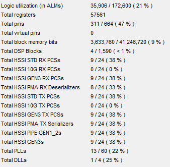

# Getting started

On the Catapult node clone this repository to a subfolder of *E:\catapult\v1.2\Roles* (the default Catapult location, which you should use) with a folder name something like *HastlayerHardwareFramework-Catapult*. Make sure that the folder is not read-only.

The HastlayerHardwareFramework-Catapult FPGA design is a modified version of the formerly created [Hastlayer Hardware Framework - Xilinx](https://github.com/Lombiq/Hastlayer-Hardware-Framework---Xilinx). The design runs on a [Microsoft Catapult](https://www.microsoft.com/en-us/research/project/project-catapult/) node, which consists of a Host-PC, and an "Mt Granite" FPGA board connected to it. Mt Granite contains an Altera Stratix V 5SGSMD5H2F35 and two channels of DDR3, each providing 4GB for a total of 8GB. The card connects to the server (Host-PC) via eight lanes of Gen3 PCI Express (PCIe). For a detailed description of the Mt Granite card, you can check the "Mt Granite Architectural Spec" document.

The HastlayerHardwareFramework-Catapult FPGA project originates from the AcademicDRAMLoopback example project, which is provided by Microsoft. This is a simple loopback test, which uses PCIe, and FPGA -> Memory operations. In this example project, the Host-PC sends data to the FPGA board via PCIe. Each transmission consists of 128 bits of data, plus control bits (buffer number, last bit, and pad). The incoming data is written to the DDR3 memory by the FPGA. The memory can be addressed via 64 bit addresses, on a simplified memory interface. After all of the incoming data has been written to the memory (we got a last bit on the PCIe), we start to read memory. The data is then sent back to the PC via PCIe packet by packet.

A PC-side software is also needed to see the operation of the AcademicDRAMLoopback example project. For this, Microsoft provided the LoopbackStressTest project, which can be recompiled in Microsoft Visual Studio, and can be used in PowerShell. During the project, a much easier PC-side software has been also created, this is the SimpleLoopbackTest (will be detailed in a later section).

For more information of the AcademicDRAMLoopback example project, and the LoopbackStressTest you can check "Catapult TACC Getting Started Guide" and "Catapult User Guide" documents.

The most important sources of the HastlayerHardwareFramework-Catapult project are detailed below.

As a baseline the Hastlayer Hardware Framework itself takes about this much resources (with the Loopback sample) from the FPGA: 

 

## The HastlayerHardwareFramework-Catapult project

The HastlayerHardwareFramework-Catapult FPGA project runs on the Mt Granite board, which contains an Altera Stratix V 5SGSMD5H2F35 FPGA. The FPGA project created in the Altera Quartus Prime IDE. 

### The Project files
The project files are located in the *Project* folder.
- *Project.qpf*: This is the main Quartus project file. You can open the project by opening this file.
- *Project.qsf*: Main Quartus project settings file. Contains settings and points to the TCL file(s).
- *Project.tcl*: Quartus settings file. Supports a limited set of TCL script. The FPGA clock frequency is set in this file. By default, it is 150 MHz. The User Guide recommends to target your final FPGA design to this clock frequency, but they also provided a list of valid clock frequencies: 25MHz, 50MHz, 75MHz, 125MHz, 133MHz, 150MHz, 160MHz, 166MHz, 175MHz, 180MHz, 187MHz, 200MHz, 220MHz, 233MHz, 250MHz, 275MHz, 300MHz.
 
### The RTL files
The RTL design files are located in the *RTL* folder.
- *app.tcl*: This is a list of source files to load into the project. Our custom  source files (like *Hast_IP.vhd*) also need to be listed in this file.
- *Role.sv*: This is the SimpleRole wrapper file. You must not modify this file. All of the Catapult-side RTL design must be made inside the *SimpleRole.sv* file, or in files instantiated in it.
- *SimpleDram.sv*: DRAM wrapper for SimpleRole, instantiated within Role.sv. Do not modify this file.
- *SimpleRole.sv*: The actual role containing user logic. This logic handles the PCIe communication with the Host-PC, controls memory operations, and communicates with our custom modules. Hast_IP is also instantiated under this source.
- *Hast_IP.vhd*: Placeholder for the automatically generated Hastlayer hardware logic. This file needs to be overwritten when a different user logic is used.

## ModelSim Altera simulation

Microsoft provided a simulation environment, in which they simulate the PC -> FPGA data flow, and you can also check your custom made logic created inside SimpleRole. You need a set of files to run the simulation.
-   *SimTop.sv*: This is a SystemVerilog test file which is located at *catapult\v1.2\Roles\Sim* on the Catapult network.
    
    SimTop simulates feeds SimpleRole with test data. You can only simulate SimpleRole, and the modules instantiated inside of it. No modules on a higher level than SimpleRole can be simulated.
- *buildSim.ps1*: A PowerShell script that builds the simulation. At the top of the script you have to specify the PC side software project to run in the simulation (ie. LoopbackStressTest or SimpleLoopbackTest).
- *RunSim.ps1*: The simulation itself can be started by running the *RunSim.ps1* PowerShell script. *RunSim.ps1* will start *buildSim.ps1* too.
- *build.do*: This is a ModelSim *.do* file. There is no option to run a Catapult design simulation in ModelSim in GUI mode so you need to run your simulations in batch mode. When you run a simulation in batch mode, you will only see console messages, no wave window signals. So you need to "record" the simulation, and when it is done, you can load it to ModelSim, and visualize it. The *.do* file is modified to do so.
The process to run a simulation is the following:
    - Navigate to the following directory: *catapult\v1.2\Roles\HastlayerHardwareFramework-Catapult\Sim*.
    - `.\runSim.ps1`
    - After the build and simulation process finished, type `vsim -view vsim.wlf -do wave.do`.

 

