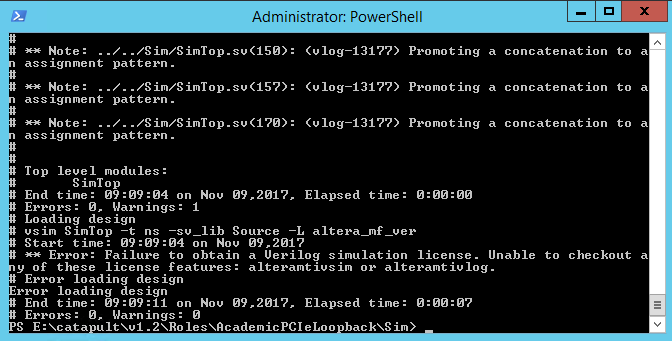
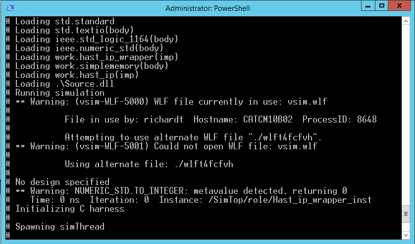

# Troubleshooting

The Microsoft Catapult Project is constantly evolving so you might need to face unexpected errors. This section is a collection of such errors that we have solved before, so you are advised to find answers here before you go to Catapult Support.

## FPGA errors

Rarely we need to encounter the issue that the FPGA gets stuck. It turns out that the FPGA can not be reconfigured, you can't rewrite the flash memory, you can't get any diagnostics data, etc. In this case you might get an error message: "Device driver is disabled. Cannot enable Device driver."

  

- According to the Catapult Support answer, if you try to program a *.sof* binary to the FPGA (instead of an *.rpd* file), the device goes into a non-responsive state. The workaround is to create an *.rpd* of your SignalTap image and load it into the Factory Slot on the flash using `rsu.exe -write <filename.rpd>`, then use `rsu.pgm -reconfig` to switch to your SignalTap image. Then you should be able to run SignalTap as usual.
- There is no possibility to power-cycle the FPGA remotely, so the best choice in this case it to ask the Catapult Support to turn on and off the device (catapsup@microsoft.com).
- Another workaround is to go to the Windows Device Manager, right click on the "Catapult FPGA device" and make sure it is enabled.  If it isn't, check the properties and see if there is an error.  You can also attempt to enable the card from there. 

## Licensing issues

Microsoft uses license servers to grant access to the Microsoft Project Catapult Academic Shell, Driver, and to the Intel/Altera FPGA IP core libraries. 

### ModelSim license issue
In November 2017 Microsoft changed its license servers from troy.tacc.utexas.edu (detailed in "Catapult TACC Getting Started Guide v1.1", section 2.2) to license02.tacc.utexas.edu (detailed in "Catapult TACC Getting Started Guide v1.2", section 2.2) to host license files.

After the license server moved, we had got licensing issues constantly. The error message says: "**Error: Faliure to obtain a Verilog simulation license. Unable to checkout any of the license features: alteramtivsim or alteramtivlog. Error loading design."

  

The issue was escalated to Altera, and they fixed the issue. The setup of the environmental variables is also corrected in "Catapult TACC Getting Started Guide v1.2".

### Quartus Prime license issue   
We also got licensing issues with Quartus Prime. It manifests itself in that we get many "-- current license file does not contain a valid license for encrypted file.. " in the Quartus Messages window after you start to compile a Quartus project.

It has been revealed that a typo in the environmental variables caused that the Quartus wasn't able to check the *MSFTAcademic.dat* file.

If you get any kind of licensing error, do the following: Double check the environmental variables! On the Microsoft Catapult node you can set the environmental variables by doing the following:
1. Click on the Windows Start menu
2. Start to type env. On the top right part of the screen you will see "Edit the system environment variables". Click on it.
3. The System Properties window will be shown. Click on the "Environment Variables..." button.
4. Make sure that the following is set both in the user and the system environmental variables section: 
  - Variable name: `LM_LICENSE_FILE`
  - Variable value: `27000@license02.tacc.utexas.edu;E:\catapult\v1.2\MSFTAcademic.dat`  
5. After you have set the environmental variables, restart the node and try to use ModelSim or Quartus project compilation again.
6. If ModelSim works, but Quartus project compilation doesn't, check that the right Device has been chosen for your project. The device name has to be "5SGSMD5H2F35I3L". The Catapult support also suggests to keep the *.qsf* file read-only, because it might get corrupted sometimes.

## ModelSim simulation issues

We use ModelSim to simulate Simplerole and our IP cores instantiated in it for test and development purposes.
You can pull in selected signals to the ModelSim wave window, which you want to examine. You are also able to manipulate these signals, like set radix, organize signals into groups, etc. This setup of signals can be saved to a .do file so you don't have to setup your signals every time when you run a test in ModelSim.

The waveform can be also saved in a *.wlf* file, which is the only way to examine the simulation results when you run it in batch mode. When you start a simulation in batch mode, the simulation results are saved in a .wlf file, which can be loaded to the ModelSim GUI after the simulation is finished, so you can examine the results.

There is an error which occurs sometimes, when you quit ModelSim, and you want to restart it later - in batch mode - with another simulation. The message says: "Warning: (vsim-WLF-5000) WLF file currently in use: vsim.wlf." However ModelSim is not running currently, some process still holds the previously generated *.wlf* file for some reason. This is only a warning message, but you have to deal with it, because ModelSim cannot be started. 

 
 
The solution in this case is the following: 
1. You need to navigate to the simulation directory (*e:\catapult\v1.2\Roles\HastlayerHardwareFramework-Catapult\Sim*) and delete the previously generated *vsim.wlf* file.
2. You need to restart the simulation in batch mode. The simulation results will be saved in a new *vsim.wlf* file.
3. After the batch mode simulation finished, you need to start ModelSim GUI, and load the *.wlf* file.
If you get into any ModelSim related issue, [ModelSim User's Manual](https://www.microsemi.com/document-portal/doc_view/131619-ModelSim-user) is a good start for searching.

## SignalTap Logic Analyzer issues

SignalTap is the Altera Quartus Prime built-in logic analyzer. We use it to debug FPGA signals when the design runs on the device, so it's not simulation, but real signals.
To check how to add SignalTap to your FPGA design, and how to use it, see the "Catapult User Guide v1.2", starting from page 26. (8.2 Adding SignalTap to Your Design) section.

It might happen that when you click on the "Scan Chain" button, the status does not switch from "Program the device to continue" to "Ready to acquire". USB blaster might not detect the FPGA, so you can't inspect FPGA signals. In this case you should check the following:
- You should uncheck "read only" for the project files. Right click on each project file, go to "Properties", and de-select "Read-only", enable SignalTap, then regenerate the bitfile. Note: This contradicts with one of the suggestions in the "Quartus Prime license issue" above, but this hint came from the Catapult Support Team and it worked.
- Double check if the right *.stp* file is being used with the *.rpd* that it was compiled against. You can't use older *.stp* files, it always has to be the exact one that you used when compiling.
- Check FPGA status with *FPGADiagnostics.exe*. If it seems to be in a non-responsive state, ask TACC support to power-cycle the FPGA.

## Getting in touch with Catapult support if nothing helps

- If none of the above helped write to the Catapult Academic Program Support at catapsup@microsoft.com. They have engineers in that email group who can answer our technical questions. If they don't answer you may send an e-mail to catapult@microsoft.com as well (as a reply to your original e-mail going to catapsup@microsoft.com).
- If you don't get an answer or if your issue is likely a hardware one or a TACC problem then open a [TACC consulting ticket](https://portal.tacc.utexas.edu/tacc-consulting/-/consult/tickets/create). 